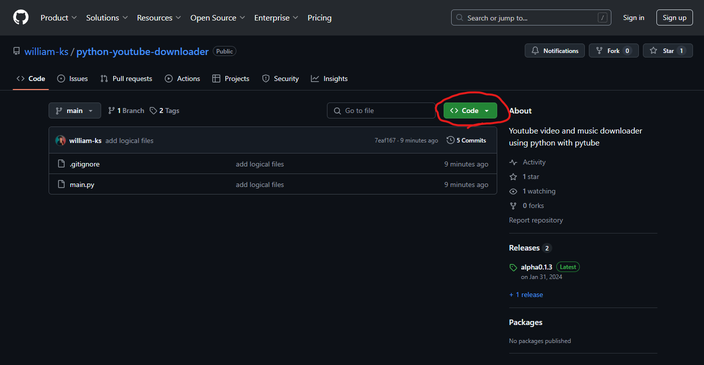
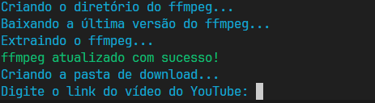

# Youtube Downloader


## Table of Contents

- [Dependencies](#dependencies)
- [Description](#description)
- [Usage](#usage)
- [Photos](#photos)

## Dependencies

- Python: [Download Python 3.12.1](https://www.python.org/ftp/python/3.12.1/python-3.12.1-amd64.exe)
- Virtual Environment (pyvenv): Run the following command in the terminal:
```bash
    pip install virtualenv
```

## Usage
1. Clone the application repository:

```bash
git clone <repository-url> downloaderApp
```
2. Navigate to the downloaded folder using the terminal.
```bash
cd  ./downloaderApp
```

3. Create a virtual environment:

```bash
python -m venv venv
```
if this step generate a error go to [Error-Handling](#error-handling)

4. Activate the virtual environment:

### On Windows:
```bash
.\venv\Scripts\activate
```
### On Linux/Mac:
```bash
source venv/bin/activate
```
5. Install the project dependencies:

```bash
pip install -r requirements.txt
```
6. Run the application:

```bash
python main.py
```

7. Follow app steps

## Photos

1.
2.
3.
4.
5.
6.
## Error-Handling

### Authorization Error ( Windows )

Para correção, em um terminal como admin faça o seguinte comando
```bash
Set-ExecutionPolicy Unrestricted
```